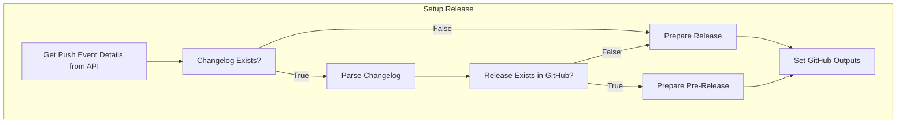
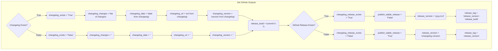

# action-setup-release
A reusable action to setup release inputs for GitHub Actions. This action is tailored to the
@LizardByte organization, but can be used by anyone if they follow the same conventions.

The action does the following:

- Get the latest push event to the default branch
- Check if `CHANGELOG.md` file exists
- If it does, parse the file and extract the following properties
  - Latest version
  - Latest version date
  - Latest version changes
  - Latest version release url
- If the changelog exists, check if the latest release is already GitHub release
- Setup the correct type of release based on the conditions above

## Simple Usage
```yaml
- name: Setup Release
  id: setup_release
  uses: LizardByte/action-setup-release@master
  with:
    github_token: ${{ secrets.GITHUB_TOKEN }}
```

## Advanced Usage
```yaml
- name: Setup Release
  id: setup_release
  uses: LizardByte/action-setup-release@master
  with:
    changelog_path: ./docs/CHANGELOG.md
    fail_on_events_api_error: true
    github_token: ${{ secrets.GITHUB_TOKEN }}
```

## Inputs
| Name                     | Description                                                  | Default        | Required |
|--------------------------|--------------------------------------------------------------|----------------|----------|
| changelog_path           | The path to the changelog file                               | `CHANGELOG.md` | `false`  |
| fail_on_events_api_error | Fail if the action cannot find this commit in the events API | `false`        | `false`  |
| github_token             | The GitHub token to use for API calls                        |                | `true`   |

## Outputs
| Name                     | Description                                                                      |
|--------------------------|----------------------------------------------------------------------------------|
| changelog_changes        | The changes for the latest version in the changelog                              |
| changelog_date           | The date for the latest version in the changelog                                 |
| changelog_exists         | Whether or not the changelog file exists                                         |
| changelog_release_exists | Whether or not the latest version is a GitHub release                            |
| changelog_url            | The url for the latest version in the changelog                                  |
| changelog_version        | The version for the latest version in the changelog                              |
| publish_stable_release   | Whether or not to publish a stable release                                       |
| release_build            | The build number to identify this build (i.e. first 7 characters of commit hash) |
| release_tag              | The tag for the release (i.e. `release_version`-`release_build`)                 |
| release_version          | The version for the release (i.e. `yyyy.m.d` or `changelog_version`)             |

## Basic Flow


## Expected Outputs

