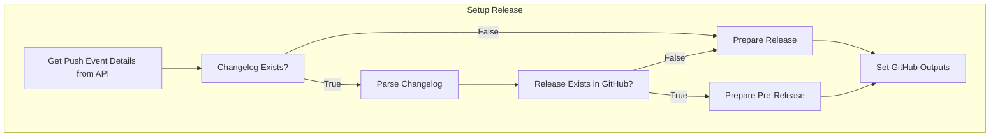

# setup-release-action
[](https://github.com/LizardByte/setup-release-action/actions/workflows/ci.yml?query=branch%3Amaster)
[](https://app.codecov.io/gh/LizardByte/setup-release-action)

A reusable action to setup release inputs for GitHub Actions. This action is tailored to the
@LizardByte organization, but can be used by anyone if they follow the same conventions.

The action does the following:

- Get the latest push event to the default branch
- Check if `CHANGELOG.md` file exists
- If it does, parse the file and extract the following properties
  - Latest version
  - Latest version date
  - Latest version changes
  - Latest version release url
- If the changelog exists, check if the latest release is already GitHub release
- Setup the correct type of release based on the conditions above

## Simple Usage
```yaml
- name: Setup Release
  id: setup_release
  uses: LizardByte/setup-release-action@master
  with:
    github_token: ${{ secrets.GITHUB_TOKEN }}
```

## Advanced Usage
```yaml
- name: Setup Release
  id: setup_release
  uses: LizardByte/setup-release-action@master
  with:
    changelog_path: ./docs/CHANGELOG.md
    fail_on_events_api_error: true
    github_token: ${{ secrets.GITHUB_TOKEN }}
```

## Inputs
| Name                         | Description                                                                                                                                            | Default        | Required |
|------------------------------|--------------------------------------------------------------------------------------------------------------------------------------------------------|----------------|----------|
| changelog_path               | The path to the changelog file                                                                                                                         | `CHANGELOG.md` | `false`  |
| dotnet                       | Whether to create a dotnet version (4 components, e.g. yyyy.mmdd.hhmm.ss).                                                                             | `false`        | `false`  |
| fail_on_events_api_error     | Fail if the action cannot find this commit in the events API                                                                                           | `false`        | `false`  |
| github_token                 | The GitHub token to use for API calls                                                                                                                  |                | `true`   |
| include_tag_prefix_in_output | Whether to include the tag prefix in the output.                                                                                                       | `true`         | `false`  |
| tag_prefix                   | The tag prefix. This will be used when searching for existing releases in GitHub API. This should not be included in the version within the changelog. | `v`            | `false`  |

## Outputs
| Name                           | Description                                                                        |
|--------------------------------|------------------------------------------------------------------------------------|
| changelog_changes              | The changes for the latest version in the changelog                                |
| changelog_date                 | The date for the latest version in the changelog                                   |
| changelog_exists               | Whether or not the changelog file exists                                           |
| changelog_release_exists       | Whether or not the latest version is a GitHub release                              |
| changelog_url                  | The url for the latest version in the changelog                                    |
| changelog_version              | The version for the latest version in the changelog                                |
| publish_pre_release            | Whether or not to publish a pre-release. The opposite of `publish_stable_release`. |
| publish_release                | Whether or not to publish a release                                                |
| publish_stable_release         | Whether or not to publish a stable release. The opposite of `publish_pre_release`. |
| release_body                   | The body for the release                                                           |
| release_commit                 | The commit hash for the release                                                    |
| release_generate_release_notes | Whether or not to generate release notes for the release                           |
| release_tag                    | The tag for the release (i.e. `release_version` with prefix)                       |
| release_version                | The version for the release (i.e. `yyyy.mmdd.hhmmss` or `changelog_version`)       |

## Basic Flow


## Expected Outputs

```mermaid
graph TD

subgraph "Set GitHub Outputs"
  A1{Changelog Exists?}
  A2(changelog_exists = 'True')
  A3(changelog_changes = \list of changes\)
  A4(changelog_date = \date from changelog\)
  A5(changelog_url = \url from changelog\)
  A6(changelog_version = \version from changelog\)

  B1(changelog_exists = 'False')
  B2(changelog_changes = '')
  B3(changelog_date = '')
  B4(changelog_url = '')
  B5(changelog_version = '')

  C1(release_commit = \commit\ )

  D1{GitHub Release Exists?}
  D2(changelog_release_exists = 'true')
  D3(publish_pre_release = 'true')
  D4(publish_stable_release = 'false')
  D5(release_body = '')
  D6(release_generate_release_notes = 'true')
  D7(release_version = 'yyyy.md.hhmmss')
  D8(release_tag = `release_version`)

  E1(changelog_release_exists = 'false')
  E2(publish_pre_release = 'false')
  E3(publish_stable_release = 'true')
  E4(release_body = changelog_changes if changelog exists else '')
  E5(release_generate_release_notes = 'false' if changelog exists else 'true')
  E6(release_version = \changelog version\)
  E7(release_tag = `release_version`)

  F1{Push Event?}
  F2(publish_release = 'true')
  F3(publish_release = 'false')
end

A1 --> |True| A2
A2 --> A3
A3 --> A4
A4 --> A5
A5 --> A6
A6 --> C1

A1 --> |False| B1
B1 --> B2
B2 --> B3
B3 --> B4
B4 --> B5
B5 --> C1

C1--> D1

D1 --> |True| D2
D2 --> D3
D3 --> D4
D4 --> D5
D5 --> D6
D6 --> D7
D7 --> D8
D8 --> F1

D1 --> |False| E1
E1 --> E2
E2 --> E3
E3 --> E4
E4 --> E5
E5 --> E6
E6 --> E7
E7 --> F1

F1 --> |True| F2
F1 --> |False| F3

```

